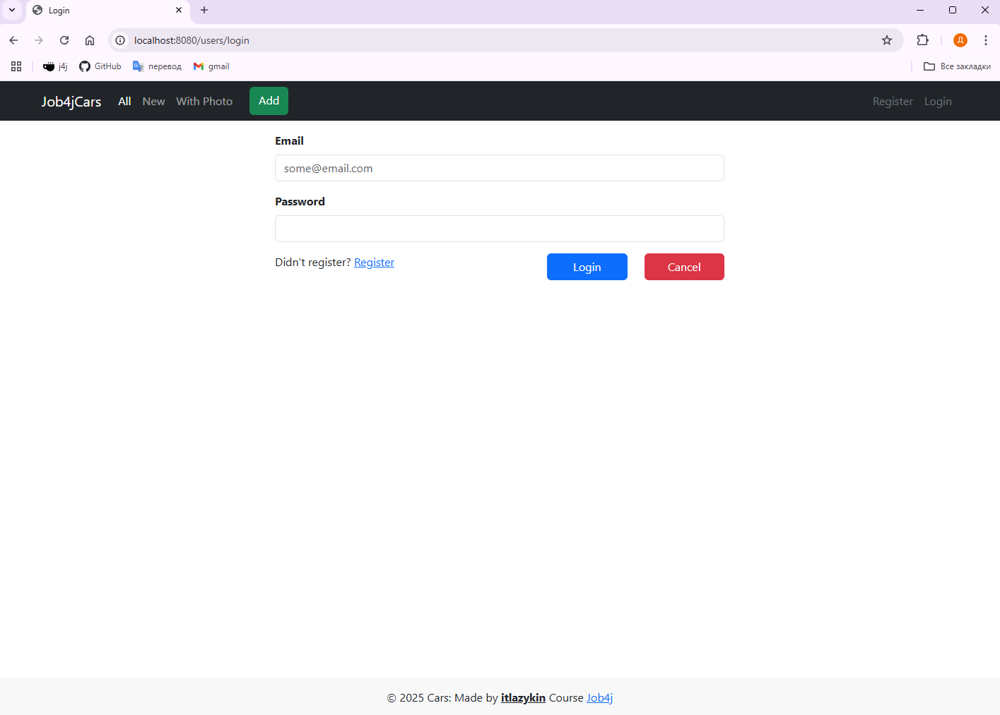
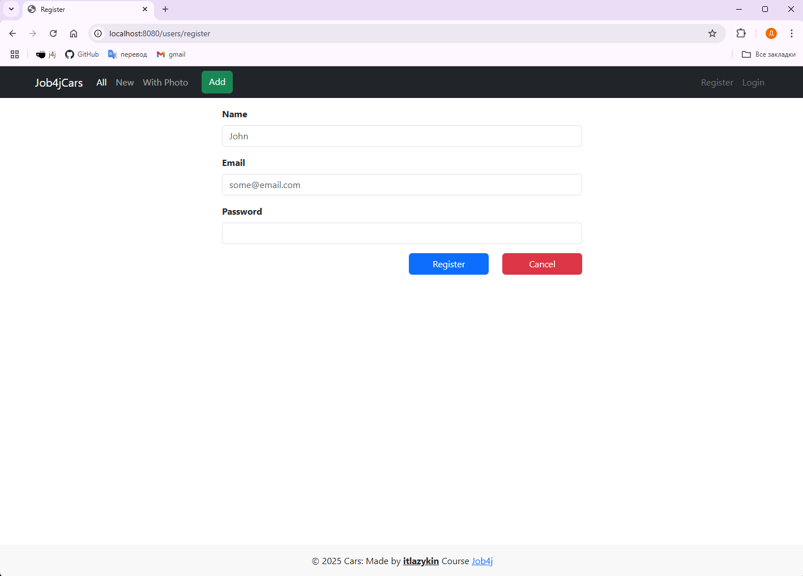
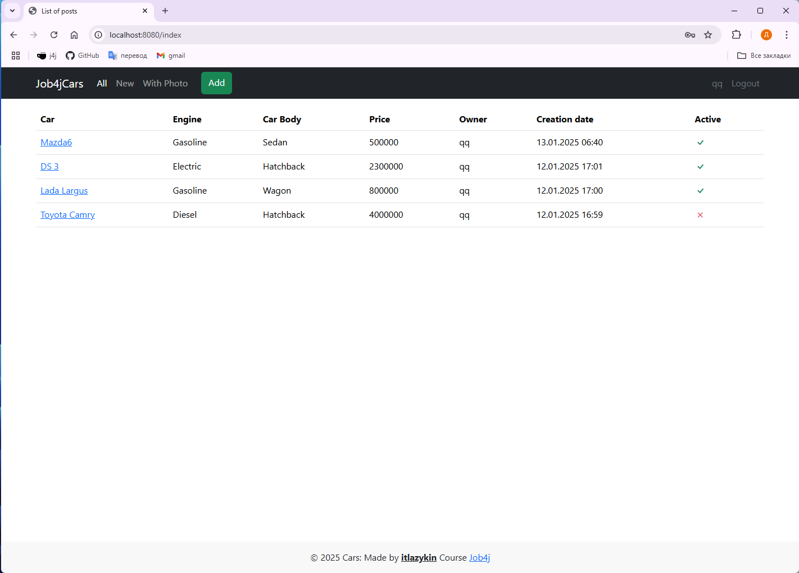
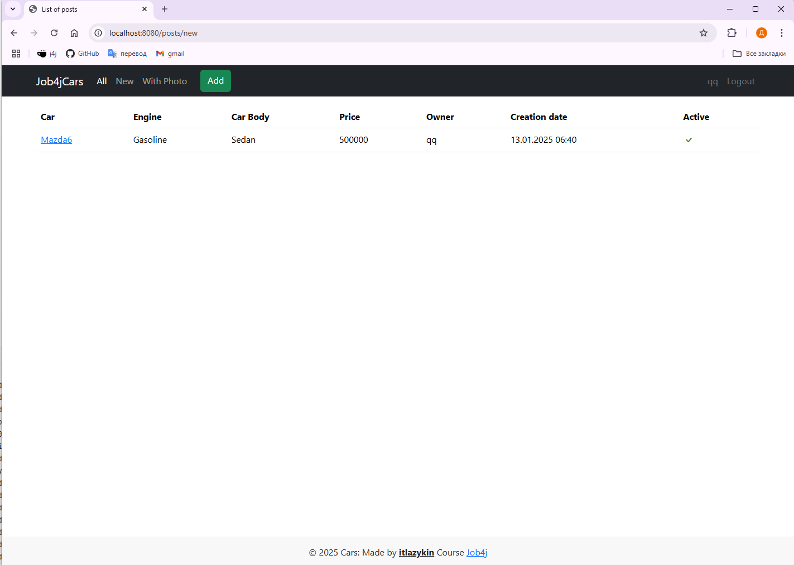
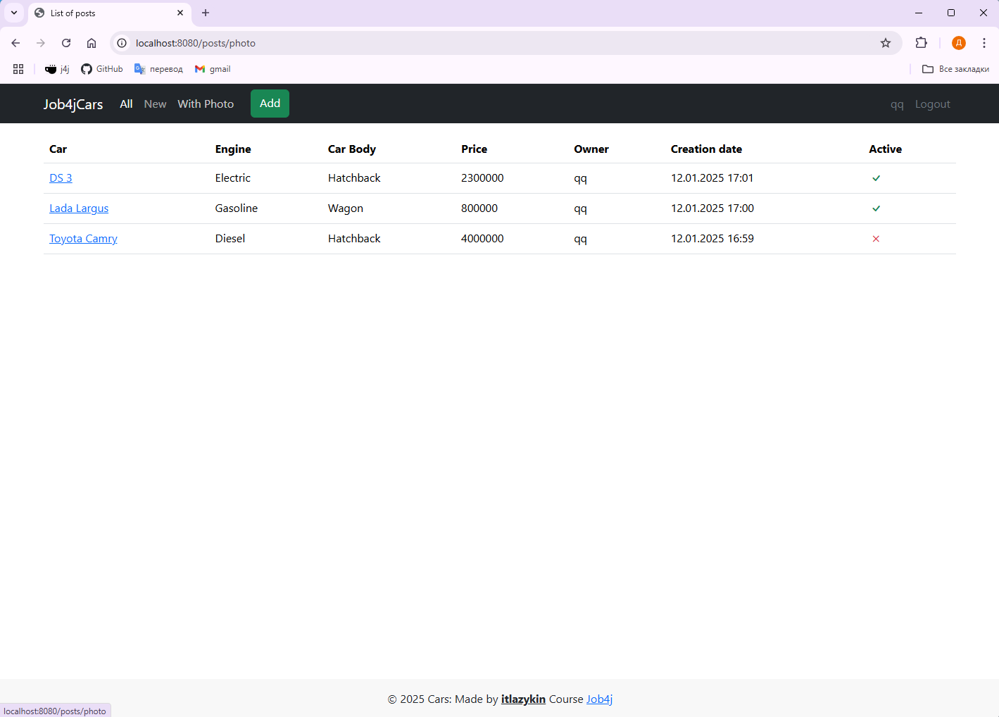
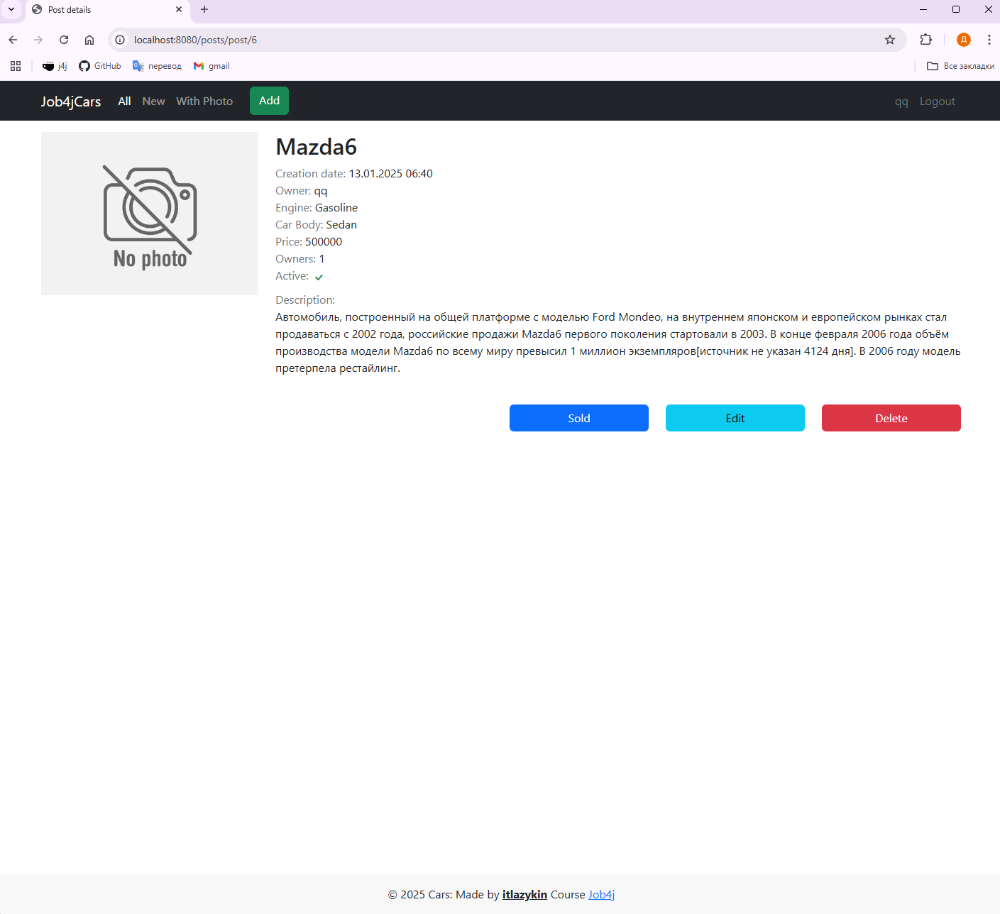
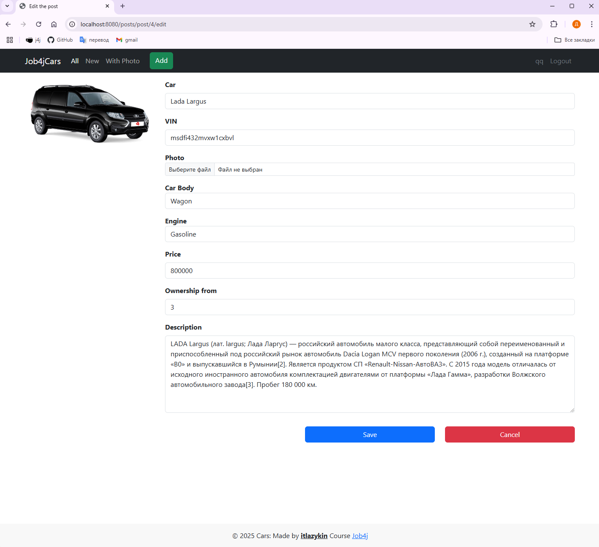
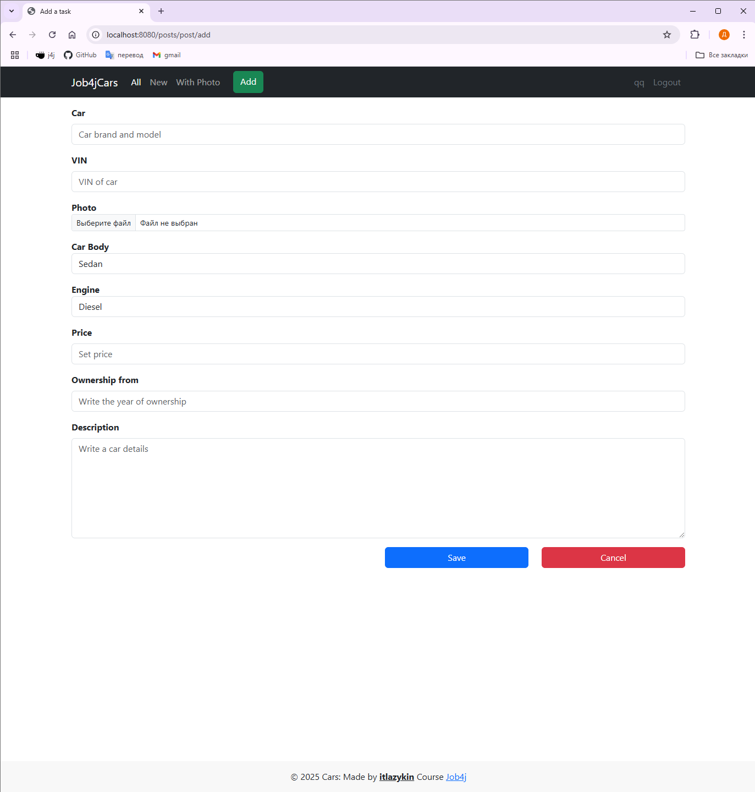
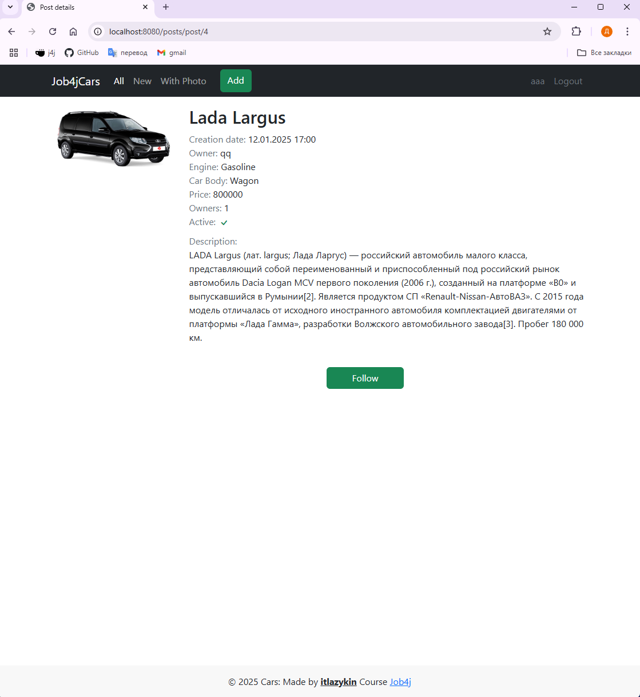
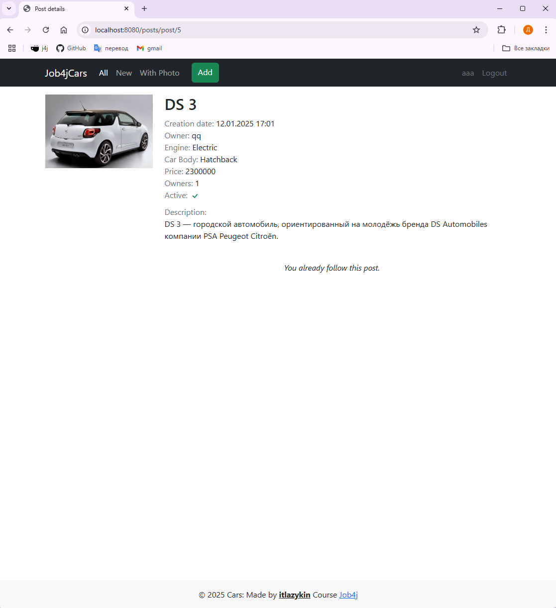

# job4j_cars

### О проекте

Этот проект - web приложение "Cars" - сервис по размещению объявлений о продаже автомобилей. Он позволяет
зарегистрировать нового пользователя или войти, если вы уже зарегистрированы. Сервис содержит объявления о продаже
автомобилей, а также позволяет публиковать новые объявления. Объявление содержит марку, модель, тип кузова, описание и
фото продаваемого автомобиля. Данные о новых пользователях и объявлениях сохраняются в БД.

### Стек технологий

+ Spring boot
+ Tomcat
+ Thymeleaf
+ Bootstrap
+ Lombok
+ Liquibase
+ PostgreSQL
+ h2database
+ Hibernate
+ jcip-annotations
+ checkstyle-plugin
+ puppycrawl

### Требования к окружению

+ Java 17
+ PostgreSQL
+ Maven

## Запуск проекта

1. Создайте базу данных

``` sql
CREATE DATABASE cars
```

2. Клонируйте репозиторий

``` bash
git clone https://github.com/itlazykin/job4j_ars
cd job4j_cars
```

3. Соберите проект с помощью Maven:

``` bash
mvn clean install 
```

4. Запустите приложение:

``` bash
mvn spring-boot:run
```

После запуска, проект будет доступен по адресу: [http://localhost:8080](http://localhost:8080)

## Взаимодействие с приложением

1. Страница входа



2. Страница регистрации



3. Все авто



4. Только новые



5. Авто с фото



6. Авто без фото



7. Редактировать объявление



8. Добавить объявление



9. Можно подписываться на объявления с других аккаунтов.



10. Страница с активной подпиской на объявление.



#### Контакты для связи:
* Лазыкин Денис Андреевич;
* +7 926 888 23 28;
* @slimdenchi